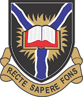

# unibadan_template

A starter template for creating thesis for the [University of Ibadan][9] students.

_Generated by [mason][1] 🧱_

## Getting Started 🚀

This is a starting point for a new brick.
A few resources to get you started if this is your first brick template:

- [Official Mason Documentation][2]
- [Code generation with Mason Blog][3]
- [Very Good Livestream: Felix Angelov Demos Mason][4]
- [Flutter Package of the Week: Mason][5]
- [Observable Flutter: Building a Mason brick][6]
- [Meet Mason: Flutter Vikings 2022][7]

## Maintainer 👷

- [Abdulrasheed Fawole (0xfc2f)][8]

[1]: https://github.com/felangel/mason
[2]: https://docs.brickhub.dev
[3]: https://verygood.ventures/blog/code-generation-with-mason
[4]: https://youtu.be/G4PTjA6tpTU
[5]: https://youtu.be/qjA0JFiPMnQ
[6]: https://youtu.be/o8B1EfcUisw
[7]: https://youtu.be/LXhgiF5HiQg
[8]: https://github.com/Abdulrasheed1729
[9]: https://ui.edu.ng
